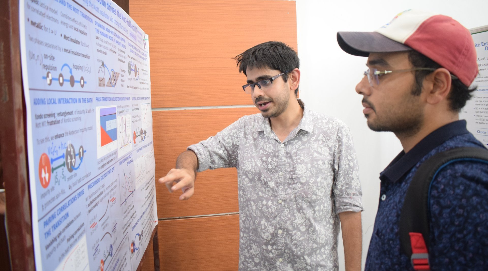

The department of physical sciences at IISER Kolkata held its DPS Day(s) this year on March 17 and 18. This is an event where we host invited talks on various themes, and the PhD students and post-doctoral researchers of the department present posters on their work.

